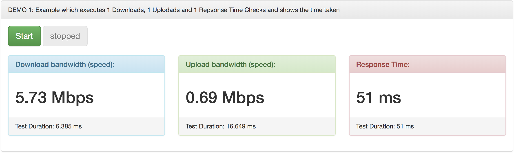
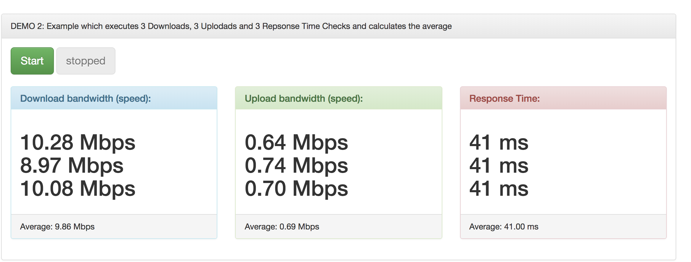
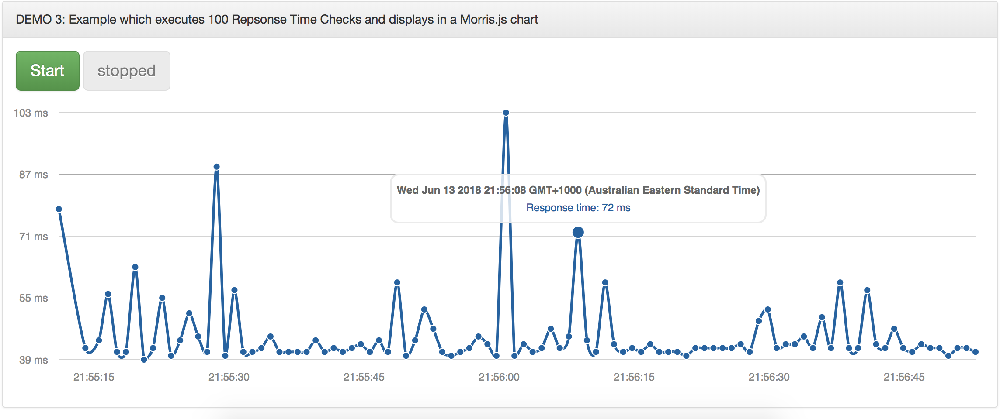

JQSpeedTest is a jQuery based plugin to check network speed in between the client and your webserver/application.
JQSpeedTest does NOT REQUIRE SERVER-SIDE SCRIPTING. The implementation is in pure JavaScript and uses NO FLASH. 
Supported servertypes are are Apache, IIS, lighttpd, Node.js, Nginx, Apache Tomcat, Tornado and many more juat needs one which accepts posts (therefore no S3).

# Main Features
* Download bandwidth (speed) test
* Upload bandwidth (speed) test
* Response Time (sping) test
* Multiple test execution
* Continues test execution
* State less
* Complete callback/asynchronous JavaScript based
* HTTPS (SSL) compatible
* Webserver independent (Apache, IIS, Nginx...)
* NO PHP/ASP/JAVA ServerSide scripting required !
* NO FLASH !
* GUI independent
* Good examples using Bootstrap for rendering
* NOT encrypted or obfuscated, fully open-source!

## Requirements
* An Webserver handling HTTP(S) that allows GET and POST requests
* A JavaScript enabled internet browser
* jQuery 1.3+ or newer

## Optional - used in the demo

* Bootstrap 3.x for rendering
* Morris.js charts engine

# Demo and Github Repo:

Demo is available at http://demo.skycube.net/jqspeedtest/

GitHub Repo is https://github.com/skycube/jqspeedtest

# Screenshots

## DEMO 1: Example which executes 1 Downloads, 1 Uplodads and 1 Repsonse Time Checks and shows the time taken

## DEMO 2: Example which executes 3 Downloads, 3 Uplodads and 3 Repsonse Time Checks and calculates the average

## DEMO 3: Example which executes 100 Repsonse Time Checks and displays in a Morris.js chart

# License
Do what ever you like to do but feel free to mention me :)

MIT License
